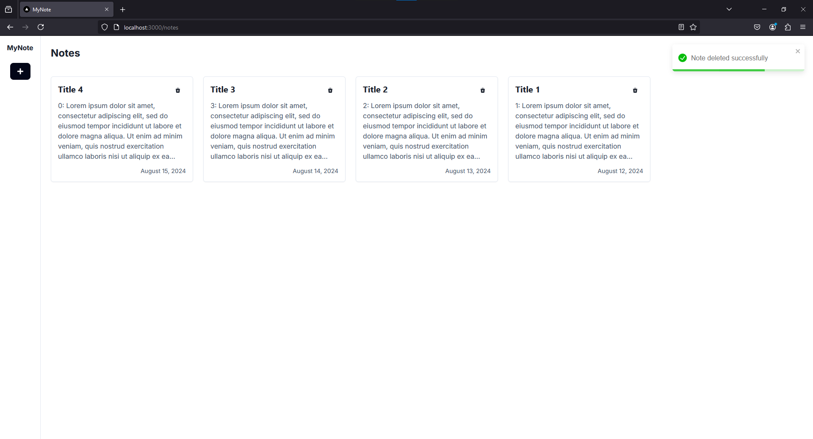
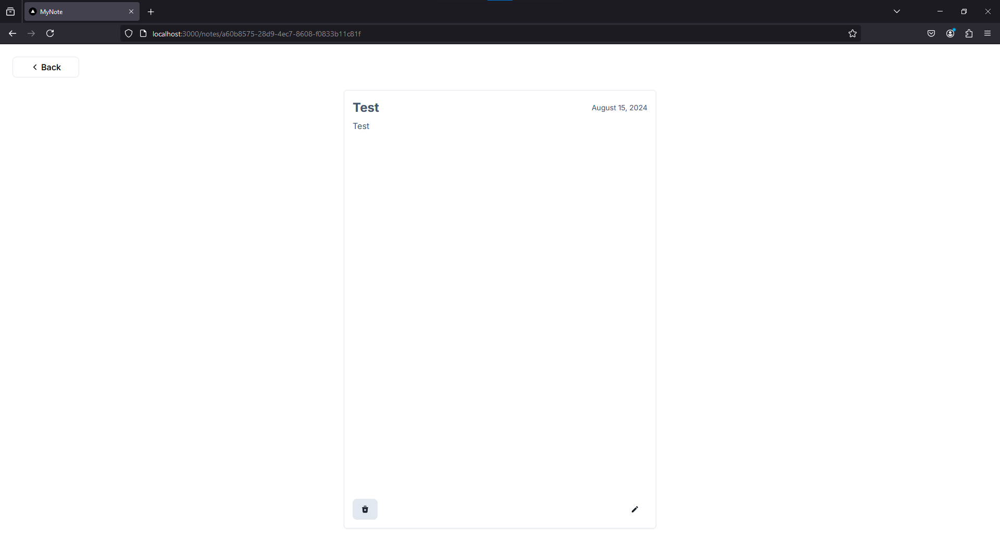

# MSIB Dibimbing.id Fullstack Engineer Study Case - Frontend

A GraphQL app to manage notes using [Next.js](https://nextjs.org/) and [Apollo Client](https://www.npmjs.com/package/@apollo/client).

## Table of Contents

- [MSIB Dibimbing.id Fullstack Engineer Study Case - Frontend](#msib-dibimbingid-fullstack-engineer-study-case---frontend)
  - [Table of Contents](#table-of-contents)
  - [Project](#project)
    - [Commands](#commands)
      - [Install Dependencies](#install-dependencies)
      - [Environment variables](#environment-variables)
      - [Development](#development)
      - [Production](#production)
    - [Structure](#structure)
    - [User Manual](#user-manual)
      - [Welcome Page](#welcome-page)
      - [Access All Notes](#access-all-notes)
        - [Empty State](#empty-state)
        - [Filled State](#filled-state)
        - [Sorted State](#sorted-state)
      - [Access Specific Note](#access-specific-note)
      - [Create Note](#create-note)
      - [Change Note Details](#change-note-details)
      - [Delete Note](#delete-note)
    - [Misc](#misc)
      - [Responsive Design](#responsive-design)
      - [Error Handling](#error-handling)
      - [Access non-existing note](#access-non-existing-note)
      - [Network Error](#network-error)

## Project

### Commands

#### Install Dependencies

```shell
npm i
```

#### Environment variables

To set up the environment variables, please add the following key-value pairs to the `.env` file:

```env
NEXT_PUBLIC_BE_API_URL=http://localhost:4000/graphql
```

Notes:

- `NEXT_PUBLIC_BE_API_URL`: GraphQL API URL ([msib-dibimbing-be](https://github.com/LyzanderAndrylie/msib-dibimbing-be)).

#### Development

Run the app in development mode with the following command:

```shell
npm run dev
```

#### Production

Run the app in production mode with the following command:

```shell
npm run build
npm run start
```

### Structure

- `src`: contains all the source code for the app.
  - `app`: contains all the source code related to Next.js routing, pages, layouts, and providers.
    - `page.tsx`: welcome page.
    - `notes`
      - `page.tsx`: notes management page.
      - `[id]`
        - `page.tsx`: note detail page.
  - `components`: contains all reusable components for the app.
  - `lib`: contains GraphQL query and mutation functionality for the app.
    - `apollo/client.ts`: Apollo client for React Server Components (RSC).
    - `types/note.tsx`: contains type definitions for the app.
    - `actions.ts`: contains server actions to mutate data.
    - `data.ts`: contains the code to query data.

### User Manual

#### Welcome Page


Click `Try Now` button to access all notes.

#### Access All Notes

##### Empty State


##### Filled State


##### Sorted State

By default, the notes will be sorted in descending order (the newest first). But, we can change the behaviour by select `Oldest` from `Sort By:`.


#### Access Specific Note

Hover over a specific note card and click it. This will navigate you to the corresponding note's page.


#### Create Note

Click the `+` button on the notes management page. This will show you a modal to fill in the information about your new note.


Fill in the necessary information about your new note. Both of fields is required. If you don't fill one of them, the error will show up to indicate which part is wrong.


If you fill the correct information, the result will be like the following.


#### Change Note Details

Click the`edit` button on the specific note page.


Fill in the information to update your note. If you don't fill one of them, the error will show up to indicate which part is wrong.


If you fill the correct information, the result will be like the following.


#### Delete Note

Access the note management page or the specific note page to delete note. Click the `trash` button to delete note. The result will be like the following.


Click the `Yes` button to delete note. The result will be like the following.



If you delete note from the specific note page, you will automatically be redirected to the note management page.




### Misc

#### Responsive Design

The app support all resolution!


#### Error Handling

The app handle common error in the app.

#### Access non-existing note


#### Network Error


